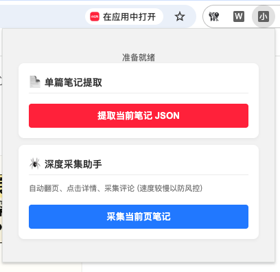

# redbook-crawler

一款用于从小红书网站提取笔记信息的 Chrome 扩展程序。

## 功能

- 从小红书网站提取笔记信息。

- 支持从探索页面提取笔记详情。

- 支持从用户个人资料页面提取用户个人资料。

- 支持从发现页面批量提取用户个人资料。

- 支持将提取的信息导出为 JSON 文件。

## 安装

1. 下载源代码。
2. 打开 Chrome 浏览器，访问 `chrome://extensions/`。
3. 启用右上角的“开发者模式”。
4. 点击左上角的“加载已解压的扩展”按钮。
5. 选择您下载源代码的文件夹。
6. 扩展程序应该已经安装完成。您可以在扩展程序列表中看到它。
7. 点击右上角的扩展程序图标打开弹出窗口。
8. 根据提示授予必要的权限。
9. 请负责任地使用本扩展，切勿将其用于非法用途。
10. 本扩展仍在开发中，部分功能可能无法正常运行。
11. 如有任何建议或反馈，欢迎提交 issue 或 pull request。
12. 感谢您使用本扩展！
13. 尽情享受扩展程序吧！

## 免责声明

1. 本扩展仅提供研究代码，不提供任何担保。作者不对因使用本扩展而造成的任何损害或损失承担责任。
2. 请负责任地使用本扩展，切勿将其用于非法用途。
3. 本扩展仍在开发中，部分功能可能无法正常运行。
4. 如有任何建议或反馈，欢迎提交 issue 或 pull request。
5. 感谢您使用本扩展！

## 许可证

MIT 许可证

更多详情请参阅 LICENSE 文件。

## DEMO

在 Chrome 浏览器中打开小红书页面，F12打开开发者模式，再点击扩展栏中的插件图标，将弹出如下操作界面。

